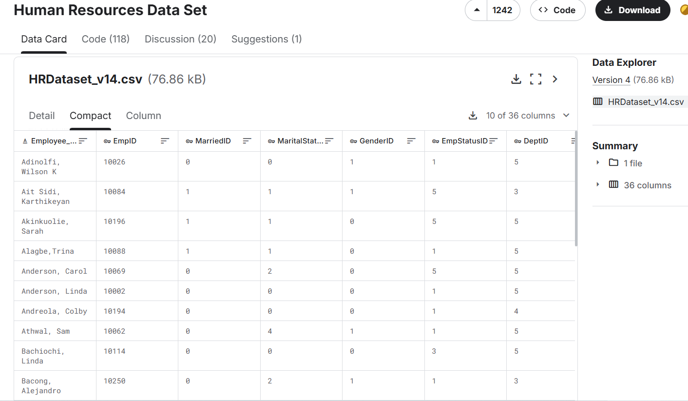
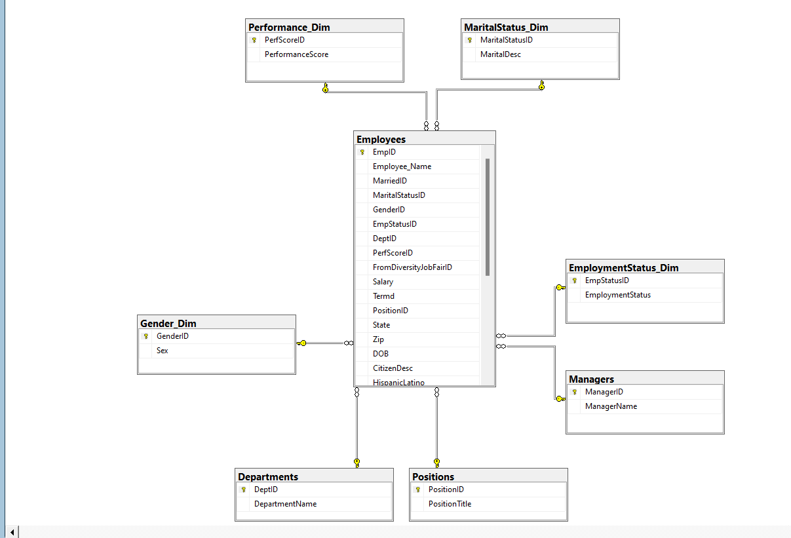
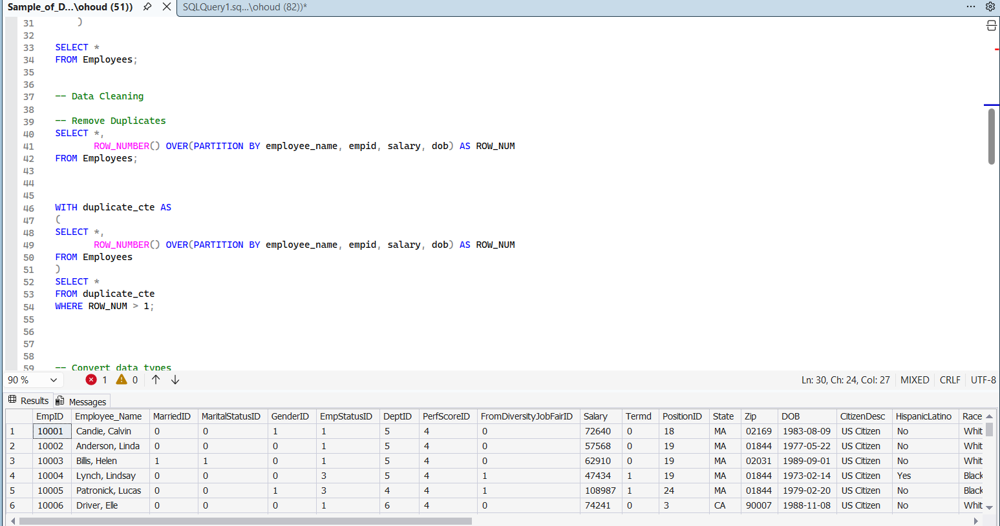
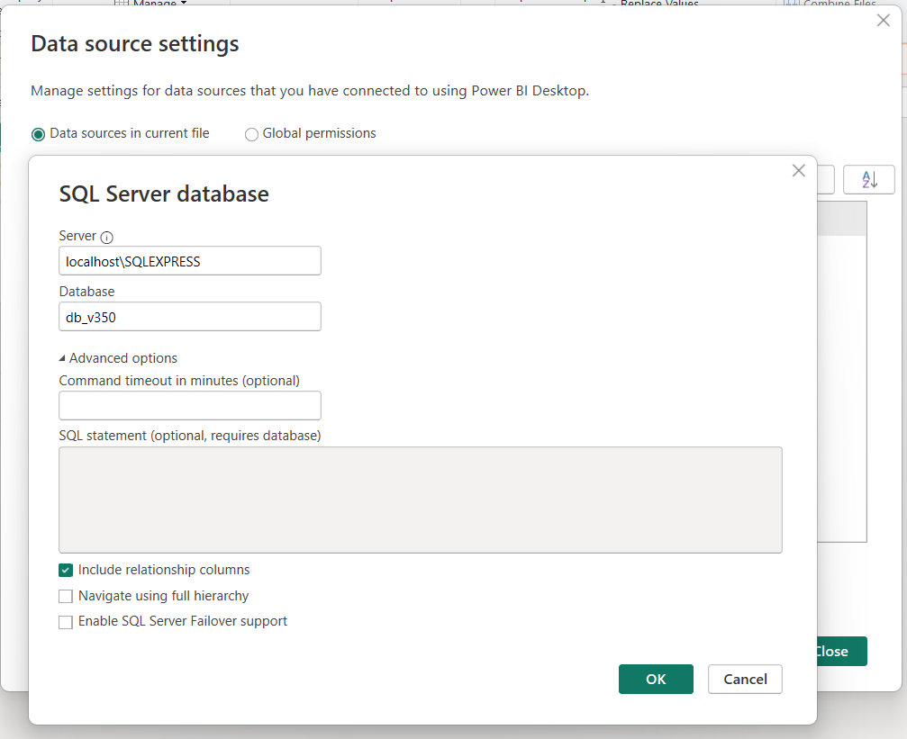
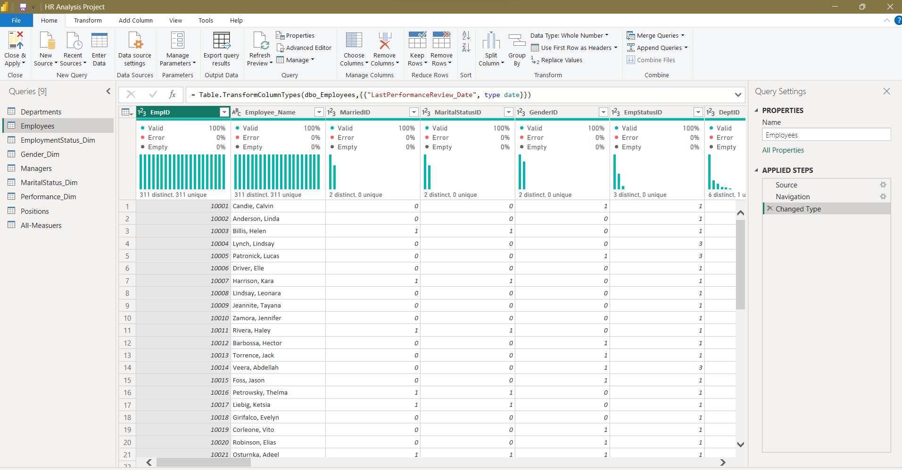
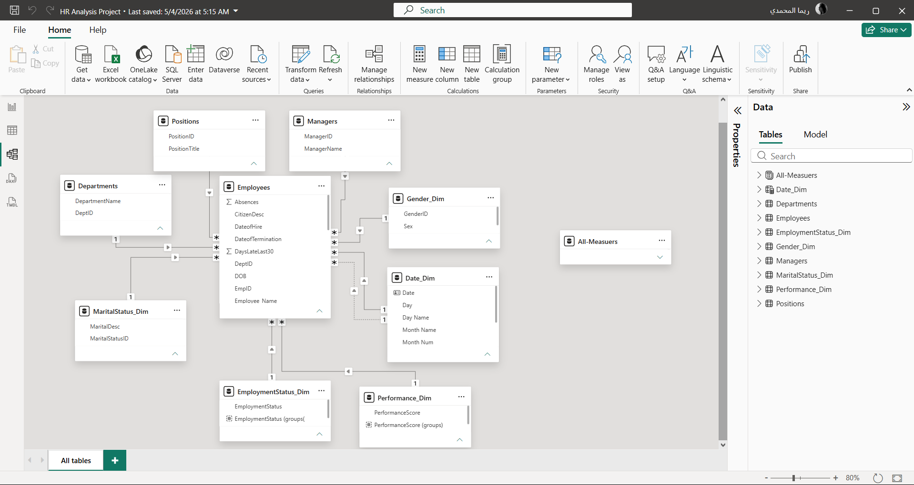
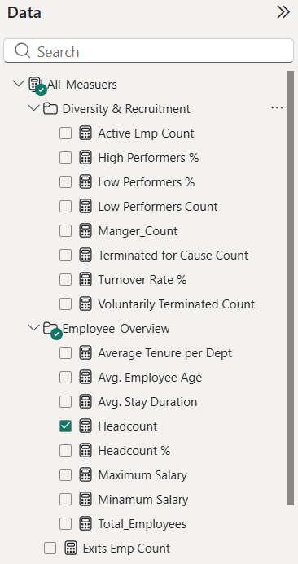
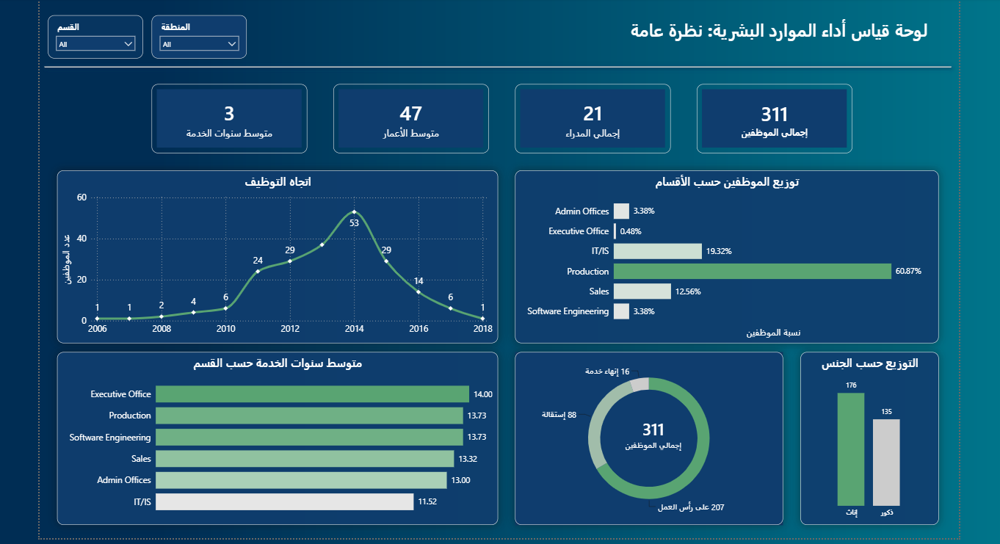
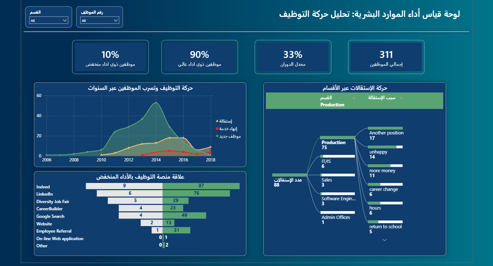
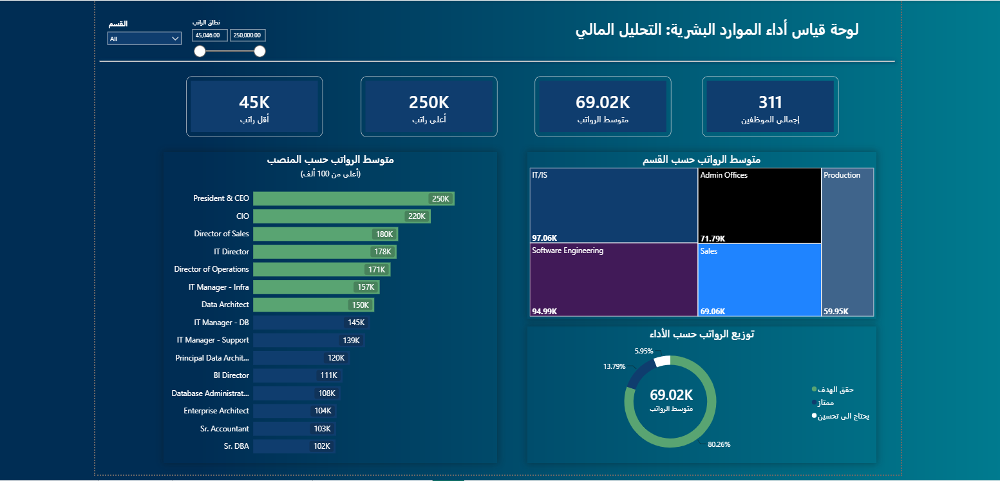

# 📊 HR Analytics & Workforce Performance Dashboard

A comprehensive HR Data Analytics project utilizing SQL for data cleaning and preprocessing, and Power BI for interactive visualization and KPI tracking. This project features dynamic dashboards designed to deliver actionable HR insights and support data-driven decision-making.

## 🛠️ Project Workflow & Technical Steps

### 1. Data Collection & Sourcing
* **Data Source:** Extracted the raw HR dataset from Kaggle containing core employee demographics, performance metrics, department allocations, and turnover details.

* **Dataset Link:** 🔗 [Kaggle HR Dataset](https://www.kaggle.com/datasets/rhuebner/human-resources-data-set/data)
 

### 2. Data Cleaning & Database Management (SQL Server) 
Utilized **SQL Server Management Studio (SSMS)** to create a structured relational database and prepare the data for reporting:
* **Schema & Table Creation:** Designed and built a relational database structure based on a **Star Schema** architecture (comprising a central Fact table for HR metrics and surrounding Dimension tables for employee attributes, departments, and dates).  

* **Relationships & Integrity:** Established primary and foreign key relationships to maintain data integrity across employee profiles, compensation, and performance metrics.
* **Data Preprocessing & Cleaning:** Data cleaning was performed to ensure the dataset was free from errors and inconsistencies.
The following steps were taken:

  #### 1. Remove Duplicates
  #### 2. Convert Data Types
  #### 3. Check Missing/NULL Values 
 

> 🔗 **View Full Sample SQL Queries File:** [Data Cleaning SQL Script](./assets/Sample_of_Data-Cleaning-SQL-Queries.sql)

### 3. Power BI Integration & Data Modeling
* **Database Connection:** Connected Power BI to SQL Server for efficient data retrieval.  

* **Data Transformation:** Applied Power Query for final data formatting and attribute structuring.  

* **Relationship Validation & Data Modeling:** Verified and refined the automatically generated relationships between the Fact and Dimension tables, ensuring proper 1-to-Many ($1:*$) cardinalities, correct primary/foreign key mappings, and single-direction cross-filtering for accurate DAX evaluations.  
 
* **DAX Calculations:** Formulated custom DAX measures for core KPIs including Total Employees (311), Turnover Rate (33%), Average Age (47), and Average Salary ($69.02K).  

---

## 📈 Dashboard Overview & Key Visuals

### Page 1: General Overview (نظرة عامة)
Focuses on macro-level workforce KPIs, departmental distribution, tenure, and overall headcount status.

* **Key Metrics:**
  * **Total Employees:** 311
  * **Total Managers:** 21
  * **Average Age:** 47 | **Average Years of Service:** 3

---

### Page 2: Recruitment & Turnover Movement (تحليل حركة التوظيف)
Analyzes hiring trends over time, employee attrition reasons, and performance rating correlation by recruitment channel.

* **Key Metrics:**
  * **Turnover Rate:** 33%
  * **High Performers:** 90% | **Low Performers:** 10%
  * **Insights:** Primary resignation cause tracked in the Production department (*Another position / Unhappy*).

---

### Page 3: Financial & Salary Analysis (التحليل المالي)
Examines compensation structure across departments, position salary averages, and performance-to-salary distribution.

* **Key Metrics:**
  * **Average Salary:** $69.02K
  * **Salary Range:** $45K (Min) – $250K (Max)
  * **Departmental Highlights:** IT/IS leading in highest average salary ($97.06K).

---

## 💡 Key Business Insights
1. **Workforce Stability:** High concentration of active staff with an average tenure of 3 years.
2. **Turnover Drivers:** Production division records the highest turnover rate (75 resignations), primarily driven by competitive position offers and job satisfaction factors.
3. **Recruitment Quality:** Platforms like *Indeed* and *LinkedIn* yield the highest volume of hires across various performance tiers.

---

## 🔒 License & Usage Note
This repository and its contents are published strictly for **viewing and demonstration purposes**. 

* **No Reuse / Redistribution:** Reproduction, modification, or commercial/non-commercial distribution of the code, queries, or dashboard structure is not permitted without explicit written approval.
* **All Rights Reserved.**
